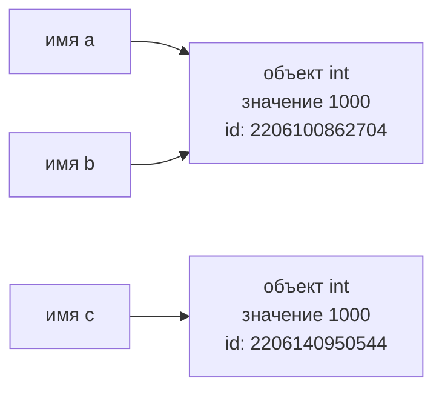

# Отчёт по лабораторной работе № 1
## Выполнение программы, объекты и базовые типы Python

---

## Цель работы

Разобраться, как CPython выполняет программу, научиться отличать имя от объекта, корректно применять операции сравнения и работать с базовыми типами данных Python

## Задачи

1. Запускать Python-код в REPL и из `.py`-файла, объяснять разницу между режимами
2. Объяснить путь программы от исходного текста до выполнения байткода; различать выражения и инструкции; изучить AST и байткод с помощью `ast` и `dis`
3. Разобраться со связыванием имён с объектами; использовать `type()`, `id()`, `==` и `is` по назначению
4. Поработать с типами `int`, `float`, `bool`, `complex`, `str` и `None`, выполнять явные преобразования типов
5. Объяснить погрешность вычислений с числами с плавающей точкой и правило их безопасного сравнения
6. Применить индексацию, срезы, Unicode и форматирование строк
7. Объединить изученные конструкции в консольной программе (информационная карточка эксперимента)

## Ход работы

1. **Задание 1 (`task_1.py`).** Выражение `2 + 3 * 4` выполнено в REPL и в файле; в файл добавлен `print()`, чтобы результат появился в терминале. Разобраны выражения, инструкции, литералы и имена в программе с f-строкой. Через `python -m ast` и `python -m dis` (Python 3.14.7) найдены узлы AST и инструкции байткода для присваивания, арифметики, загрузки константы и вызова функции
2. **Задание 2 (`task_2.py`).** Исследованы `a`, `b`, `c` (`type()`, `id()`, `==`, `is`), построена схема имён и объектов. Проверка `c = None` выполнена через `is`. Отдельно изучено сравнение строк `"python"` и `"py" + "thon"`, сформулировано правило выбора между `==` и `is`
3. **Задание 3 (`task_3.py`).** Выполнены четыре эксперимента: арифметика `int` (`x = 17`, `y = 5`), большие целые (`2 ** 1000`), `float` (`0.1 + 0.2`, `math.isclose`), а также `bool`, `complex` и явные преобразования типов
4. **Задание 4 (`task_4.py`).** Выполнены индексация и срезы, смена регистра, инициалы, разворот строки, три способа форматирования (`%`, `.format()`, f-строка), исследование Unicode (`ord()`, `chr()`, `encode("utf-8")`) и проверка неизменяемости строк
5. **Задание 5 (`task_5.py`).** Написана программа-карточка эксперимента: ввод данных с явными `int()` / `float()`, вычисление длительности, комплексного коэффициента, квадрата модуля и `has_runs`, вывод карточки с f-строками и диагностической строки с типами

---

## Задание 1. От исходного кода к байткоду

### Часть 1. Режимы запуска

В PyCharm для вывода результата вычисления `2 + 3 * 4` я добавил функцию `print()`

В REPL результат отображается автоматически, потому что REPL — это интерактивный режим (вычисляет выражение и сразу показывает его значение). PyCharm же просто выполняет код файла как программу, значение выражения нигде не сохраняется и не выводится само по себе, поэтому нужна функция `print()`

### Часть 2. Выражения и инструкции

Код:

```python
course = "Python"
hours = 4 * 2
print(f"{course}: {hours} часов")
```

- **выражения:** `"Python"`, `4 * 2`, `f"{course}: {hours} часов"`, `course` и `hours` внутри `print`
- **инструкции:** все три строки — они говорят интерпретатору, что сделать
- **литералы:** `"Python"`, `4`, `2`, `" часов"`
- **имена:** `course`, `hours`, `print`

### Часть 3. AST и байткод

Версия интерпретатора: **Python 3.14.7**

Присваивание и арифметическая операция (AST):

```
Assign(
    targets=[Name(id='course', ctx=Store())],
    value=Constant(value='Python')),
Assign(
    targets=[Name(id='hours', ctx=Store())],
    value=BinOp(
        left=Constant(value=4),
        op=Mult(),
        right=Constant(value=2))),
```

Вызов `print()` (AST):

```
value=Call(
    func=Name(id='print', ctx=Load()),
    args=[
        BinOp(
            left=Constant(value=2),
            op=Add(),
            right=BinOp(
                left=Constant(value=3),
                op=Mult(),
                right=Constant(value=4)))])
```

Загрузка константы (байткод):

```
2  LOAD_CONST   1 ('Python')
   STORE_NAME   1 (course)
```

Вызов функции (байткод):

```
1  LOAD_NAME    0 (print)
```

### Контрольный вопрос

**Почему байткод CPython нельзя считать машинным кодом процессора?**

Байткод CPython более высокоуровневый, чем машинный код, и рассчитан не на процессор, а на виртуальную машину Python. Процессор его не понимает и выполнить сам не может: байткод исполняет интерпретатор CPython, который читает его инструкции и выполняет соответствующие действия уже скомпилированным машинным кодом. Поэтому байткод не привязан к архитектуре процессора

---

## Задание 2. Имена, объекты и сравнение

Код:

```python
a = 1000
b = a
c = int("1000")

print("Типы:", type(a), type(b), type(c))
print("Идентификаторы:", id(a), id(b), id(c))
print("a == b:", a == b)
print("a is b:", a is b)
print("a == c:", a == c)
print("a is c:", a is c)
```

**Прогноз:** программа выведет `True` 4 раза, т.к. тип данных и значение везде одинаковые

**Фактический результат:**

```
Типы: <class 'int'> <class 'int'> <class 'int'>
Идентификаторы: 2206100862704 2206100862704 2206140950544
a == b: True
a is b: True
a == c: True
a is c: False
```

**Расхождение с прогнозом:** `a is c` дал `False`, а не `True`, как я предполагал. Значения `a` и `c` равны, но это два разных объекта в памяти (разные `id`), а `is` сравнивает не значения, а именно это

### 1. Схема имён и объектов



Текстовый вариант:

```
a ──┐
    ├──> [int 1000, id=2206100862704]
b ──┘

c ──> [int 1000, id=2206140950544]
```

`b = a` не создаёт новую переменную, а делает ссылку на уже существующий объект, из-за этого идентификаторы `a` и `b` совпадают. У `c` класс и значение те же самые, что у `a`, но идентификатор другой, т.к. `int("1000")` создаёт отдельный объект

### 2. Равенство значений и идентичность объектов

`==` сравнивает значения в переменных — то, что в них хранится. `is` сравнивает идентификаторы (`id()`) — то есть отвечает на вопрос, один ли это объект в памяти или два разных с одинаковым значением

### 3. Проверка c = None

```python
c = None
print(c is None)
```

Ожидаемый и единственно возможный результат — `True`. Это не зависит от версии Python: `None` в CPython существует в единственном экземпляре, поэтому любое имя, которому присвоено `None`, всегда указывает на один и тот же объект

### 4. Эксперимент со строками

```python
first = "python"
second = "py" + "thon"

print(first == second)
print(first is second)
```

**Прогноз:** `first == second` — `True`, т.к. строки совпадают по содержанию. `first is second` должно быть `false`, тк это отдельные переменные

**Фактический результат:** оба выражения дают `True`

**Объяснение:** `"py" + "thon"` состоит только из констант, поэтому Python вычисляет это выражение ещё на этапе компиляции (constant folding). В скомпилированной программе `second` — это уже готовая строка `"python"`, как будто она так и была написана. Короткие строки из букв интернируются, поэтому `first` и `second` указывают на один и тот же объект, и `is` тоже даёт `True`. Если бы строка собиралась во время выполнения (например, из `input()`), результат `is`, скорее всего, был бы `False`, хотя `==` всё равно остался бы `True`

### 5. Правило: когда `==`, а когда `is`

`==` стоит применять, если нужно сравнить значения переменных — одинаковое ли в них содержимое (числа, строки, любые данные). `is` используется, когда важно, что это именно тот же самый объект, а не просто равный ему — на практике это почти всегда `x is None`. Делать вывод о равенстве значений по совпадению `id()` нельзя: интернирование строк и кеширование чисел — детали реализации, а не гарантия языка

### Контрольные вопросы

1. Инструкция `b = a` не создаёт копию объекта, а делает ссылку на уже существующую переменную
2. `type()` возвращает тип объекта (класс, к которому он относится), `id()` возвращает уникальный идентификатор объекта в памяти (по факту его адрес в CPython), по которому можно понять, один это объект или два разных
3. `None` принято сравнивать через `is`, т.к. в Python он существует в единственном экземпляре, и `is` как раз проверяет, что это тот самый один объект, а не создание нового с тем же значением. Числа и строки сравнивают через `==`, т.к. для них важно совпадение значения, а не то, один это объект в памяти или несколько (одинаковые числа и строки вполне могут храниться как разные объекты)

---

## Задание 3. Числовые типы, операции и преобразования

### Эксперимент A. `int` и арифметические операторы

Для `x = 17`, `y = 5`:

**Прогноз:** почти все операции дадут `int`, кроме `/`, она должна дать `float`, т.к. деление не всегда делится нацело

**Фактический результат:**

```
22 <class 'int'>
12 <class 'int'>
85 <class 'int'>
3.4 <class 'float'>
3 <class 'int'>
2 <class 'int'>
1419857 <class 'int'>
```

Прогноз полностью подтвердился, расхождений нет

`/` — оператор обычного (true) деления, он всегда возвращает `float`, даже если числа делятся нацело (например, `10 / 2` даст `5.0`, а не `5`). Это сделано специально, чтобы результат деления был предсказуемым и не зависел от того, поделилось нацело или нет

`//` — оператор целочисленного (floor) деления, он берёт результат деления и округляет вниз до целого. Если оба операнда `int`, результат тоже будет `int`, т.к. Python не видит смысла делать его `float`. А если хотя бы один из операндов `float` (например, `17.0 // 5`), то и результат будет `float`, просто уже без дробной части

То есть разница не только в значении, а в том, что `/` считает, сколько получится при делении, а `//` считает, сколько раз `y` целиком помещается в `x`

### Эксперимент B. Большие целые числа

```python
print(2 ** 1000)
```

Результат — большое целое число без потери точности (полный вывод см. в `task_3.py`, начинается с `10715086...`)

В большинстве языков (C, Java и т.д.) `int` занимает фиксированный размер в памяти, например 32 или 64 бита. Из-за этого у него есть чёткий предел значений, и если число выходит за эти границы, происходит переполнение: число может «обнулиться» и начать считать заново с минимума, или вообще упасть с ошибкой, в зависимости от языка

В Python `int` устроен иначе — у него нет фиксированного размера и нет предела значений, кроме реального объёма памяти компьютера. Если число становится слишком большим, Python сам под капотом выделяет под него больше памяти. Из-за этого можно спокойно посчитать `2 ** 1000` и получить точный результат без переполнения, хотя это займёт больше памяти и будет работать чуть медленнее, чем с обычным фиксированным `int`

### Эксперимент C. `float`

```python
result = 0.1 + 0.2
```

**Прогноз:** `result` будет ровно `0.3`. Поэтому `result == 0.3`, скорее всего, даст `True` и `math.isclose` — `True`

**Фактический результат:**

```
result = 0.30000000000000004
result == 0.3 → False
result - 0.3 → 5.551115123125783e-17
math.isclose(result, 0.3) → True
```

Прогноз не подтвердился

**Объяснение через двоичное представление:** компьютер хранит `float` не в десятичной системе, а в двоичной (по стандарту IEEE 754). Многие обычные десятичные дроби (`0.1`, `0.2`, `0.3`) невозможно точно представить в двоичном виде — точно так же как `1/3` нельзя точно записать в виде конечной десятичной дроби. Поэтому `0.1` и `0.2` хранятся с крошечной погрешностью, и при сложении погрешности складываются. В итоге `result` получается не ровно `0.3`, а `0.3` плюс ошибка порядка `10^-17`, что и подтверждает `result - 0.3`

**Правило безопасного сравнения:** `float` нельзя сравнивать через `==` напрямую, т.к. из-за погрешностей представления даже математически верные вычисления могут дать чуть-чуть другое число. Вместо этого нужно использовать `math.isclose(a, b)`, которая сравнивает числа с небольшой допустимой погрешностью, а не побитово

### Эксперимент D. `bool`, `complex` и явное преобразование типов

**Прогноз:** `bool(0)` — `False`, `bool(-1)` — `True` (любое ненулевое число — истина), `bool("")` — `False` (пустая строка), `bool("False")` — `True` (непустая строка)

**Фактический результат:** прогноз подтвердился по всем четырём значениям

**Почему `bool("False")` даёт `True`:** `bool()` для строк смотрит только на одно — пустая строка или нет. Пустая строка `""` всегда `False`, а любая непустая строка, даже `"False"`, `"0"` или `"no"`, будет `True`, потому что как объект она существует и не пустая. Python не разбирает смысл текста внутри строки, ему важен только сам факт, что там что-то есть

`complex(2, -3)` создаёт число `(2-3j)`, где `2` — действительная часть, `-3` — мнимая. Через `.real` и `.imag` они извлекаются отдельно как `2.0` и `-3.0`

### Контрольные вопросы

1. Результат обычного деления (`/`) всегда имеет тип `float`, потому что так сделано специально в Python 3, чтобы результат деления был предсказуемым и не зависел от того, поделилось нацело или нет
2. `int("42")` — преобразование из строки: Python парсит текст `"42"` и превращает его в число, строка должна выглядеть как целое число, иначе будет ошибка. `int(42.9)` — преобразование из `float`: дробная часть просто отбрасывается (не округляется, а обрезается), получается `42`. То есть в первом случае — чтение числа из текста, во втором — усечение уже существующего числа
3. Falsy значения из эксперимента D: `bool(0)` и `bool("")`, т.к. `0` — falsy среди чисел, а пустая строка `""` — falsy среди строк. Остальные (`bool(-1)`, `bool("False")`) — truthy

---

## Задание 4. Строки, Unicode и форматирование

Исходные данные: `student = "Анна Смирнова"`, `course = "Основы программирования на Python"`, `completed = 7`, `total = 10`

Пункты 1–6 (первый/последний символ, срезы с именем и фамилией, регистр, инициалы, разворот строки, три способа форматирования) выполнены в `task_4.py`, вывод соответствует ожидаемому формату `Анна Смирнова — Основы программирования на Python: 7/10 (70.0%)`

### 7. Unicode

```python
symbol = "Я"
```

**Прогноз:** символ выведется как есть, `ord()` даст большое число (не 1–2-значное, т.к. это не латиница), `chr(ord(symbol))` вернёт обратно тот же символ, а `encode("utf-8")` даст больше 1 байта, т.к. кириллица не помещается в 1 байт

**Объяснение:** `ord()` возвращает числовой код символа в Unicode (кодовую точку), `chr()` делает обратное — по числу восстанавливает символ, поэтому `chr(ord(symbol)) == symbol`. `encode("utf-8")` превращает символ в последовательность байт по правилам кодировки UTF-8, и для кириллицы это обычно 2 байта на символ (в отличие от латиницы, где 1 символ = 1 байт)

### 8. Ошибка присваивания по индексу

```python
symbol = "Я"
# symbol[0] = "А"
# Traceback (most recent call last):
#   File "...", line X, in <module>
#     symbol[0] = "А"
# TypeError: 'str' object does not support item assignment
```

Python выдаёт `TypeError`, потому что строки в Python неизменяемые (immutable) — у них нет операции присваивания по индексу. Чтобы «изменить» строку, на самом деле нужно создать новую строку, а старая останется без изменений

### Контрольные вопросы

1. `len(symbol)` считает количество символов (кодовых точек Unicode) в строке, а `len(symbol.encode("utf-8"))` считает количество байт после кодирования. Для латиницы это обычно совпадает, а для кириллицы, эмодзи и других не-ASCII символов один символ может занимать 2–4 байта в UTF-8, поэтому числа расходятся
2. В записи `text[start:stop:step]` `start` — индекс, с которого начинается срез (включительно), `stop` — индекс, на котором срез заканчивается (не включая его самого), `step` — шаг, с которым берутся символы. Если `step` отрицательный, срез идёт с конца в начало. Любой из параметров можно опустить — тогда используется значение по умолчанию
3. Строка считается неизменяемым объектом, потому что после создания её нельзя поменять «на месте» — нет способа изменить хоть один символ внутри уже существующей строки. Методы вроде `.upper()` не трогают исходную строку, а создают и возвращают новую строку с результатом, а старая остаётся в памяти без изменений

---

## Задание 5. Информационная карточка вычислительного эксперимента

Программа `task_5.py` запрашивает данные исследователя и параметры эксперимента, вычисляет общую длительность запусков, комплексный коэффициент, квадрат его модуля и признак `has_runs`, после чего выводит оформленную карточку и диагностическую строку с типами введённых значений

### 1. Имена и типы объектов после выполнения

После ввода и преобразований: `researcher` и `experiment` связаны со `str`, `runs` — с `int`, `duration`, `coef_real`, `coef_imag` — с `float`, `coefficient` — с `complex`, `total_seconds` и `total_minutes` — с `float`, `magnitude_squared` — с `float`, `has_runs` — с `bool`

### 2. Разбор арифметической строки

Строка `total_seconds = runs * duration`:
- имена: `runs`, `duration`, `total_seconds`
- оператор: `*` (умножение)
- литералы: отсутствуют, т.к. оба операнда — переменные, а не константы
- вызовы функций: отсутствуют

### 3. Путь программы

Исходный код в `task_5.py` → парсер разбирает текст в AST (дерево, отражающее структуру программы) → компилятор превращает AST в байткод CPython → байткод построчно выполняется виртуальной машиной CPython, которая и производит реальные действия (ввод, вычисления, вывод)

### 4. Почему input() нужно преобразовывать

`input()` всегда возвращает `str`, даже если пользователь ввёл число. Без явного преобразования через `int()`/`float()` любая попытка арифметики (например, `runs * duration`) либо вызовет ошибку (`str` нельзя умножить на `float`), либо сработает не так, как ожидается (например, `str * int` просто повторит строку несколько раз, а не перемножит числа)

### Контрольный вопрос

Что изменится на уровне объектов и связывания имён после повторного присваивания нового значения уже существующему имени?

После повторного присваивания существующее имя просто перестаёт указывать на старый объект и начинает указывать на новый (или на уже существующий подходящий объект, если он есть — например, маленькое число или `None`). Старый объект при этом не меняется и не исчезает сразу — он остаётся в памяти, пока на него ссылается хоть одно другое имя, а если ссылок больше нет, его удалит сборщик мусора

---

## Общий вывод

Три особенности Python, которые оказались наиболее неожиданными:

1. *что `0.1 + 0.2` не равно `0.3` — до эксперимента C казалось, что арифметика с обычными десятичными дробями всегда точна*
2. *что `"py" + "thon" is "python"` может быть `True` — не ожидал, что компилятор заранее посчитает строку и переиспользует один и тот же объект*
3. *что у `int` в Python нет предела значений, в отличие от других языков*
